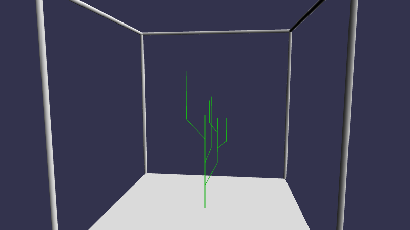

Final project for the Creative Coding I class, winter term 2018/2019, at Filmuniversität Konrad Wolf Babelsberg.

# What is it?

This was an experiment to procedurally generate 3D trees. It's an effort of about three days from build setup to rendering. Most of the time was spent on code refactoring and finding an expressive way to describe the tree in code, so the visual presentation is rather bare-bones. I used it as an opportunity to get practical experience with generator functions and a more functional approach to TypeScript, which appears to fit the ProcGen concept pretty well.



# Requirements

You need NodeJS and NPM to install dependencies and build the project. It uses BabylonJS for rendering, is written in TypeScript and uses Webpack to bundle all the scripts together.

# Installation

```
npm install
```

# Development Server

This will launch a development web server with live reloading, available on `localhost:8080`

```
npm run dev
```

# Build

This will generate a rather large JavaScript file (currently about 2.5 MiB).

```
npm run build
```

Then all files should be in place to run a local web server (e.g. [https://www.npmjs.com/package/http-server](http-server)) from the project's root directory and view it in the browser.
